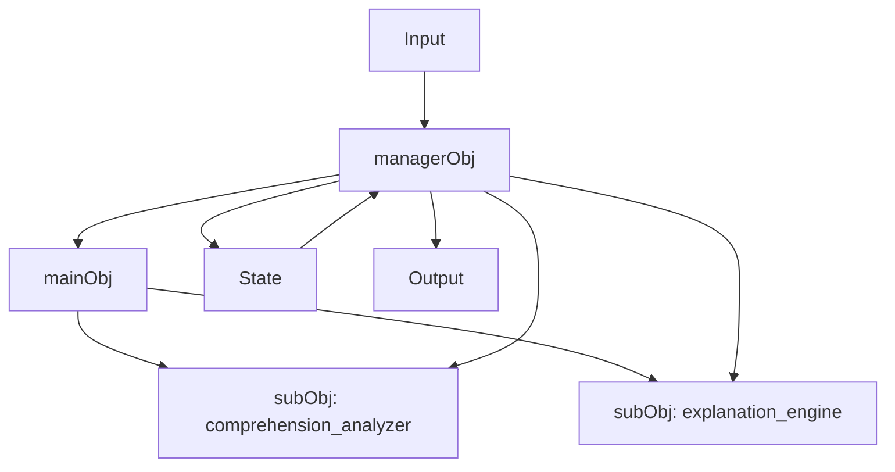

# Open ALO Complete Implementation Guide

> **This document is the implementation entry point.**
>
> If you are an implementation agent, read this file first, then `docs/spec.md`.
>
> The purpose of this document is to make the entire Open ALO concept understandable without relying on prior conversation history.

---

# 1. What Open ALO is

Open ALO is an open-source implementation framework for **ALO (Abstract Language Object)**.

An ALO is a language-defined object model that allows an LLM to represent and operate a concept, system, role, or dynamic situation while keeping its structure and mutable state explicit.

The canonical ALO model has four required conceptual components:

1. `mainObj`
2. `subObjList`
3. `State`
4. `managerObj`

These four concepts define ALO.

Everything else in this repository exists to author, visualize, execute, test, or share that model.

---

# 2. The four canonical ALO components

## 2.1 mainObj

`mainObj` is the top-level language object.

It represents the entire concept or system being modeled.

Examples:

- programming learning coach
- business simulator
- project manager
- research assistant
- organization model
- user-specific cognitive model

It should define:

- identity;
- purpose;
- scope;
- responsibilities;
- relationships to sub-objects.

Example:

```yaml
mainObj:
  id: learning_coach
  name: Programming Learning Coach
  purpose: Support the learner while maintaining an explicit learning state.
  responsibilities:
    - coordinate learning support
    - maintain coherence across sub-objects
```

---

## 2.2 subObjList

`subObjList` contains child language objects that make up the main object.

A sub-object is not merely a function call or decision node.

It represents a meaningful conceptual component, role, capability, or subsystem.

Example:

```yaml
subObjList:
  - id: comprehension_analyzer
    purpose: Evaluate learner understanding.

  - id: motivation_manager
    purpose: Track motivation and engagement.

  - id: explanation_engine
    purpose: Produce explanations appropriate to the current State.
```

Sub-objects may have their own responsibilities and state relationships.

---

## 2.3 State

`State` is the mutable state of the ALO.

It represents what the ALO currently knows or believes about its own dynamic condition.

Examples:

- current level;
- progress;
- active status;
- memory;
- current task;
- confidence;
- mode;
- selected strategy.

Example:

```yaml
State:
  level:
    type: integer
    value: 1

  progress:
    type: number
    value: 0.0

  memory:
    type: list
    value: []

  activeStatus:
    type: string
    value: initializing
```

For reproducibility, State should be explicit, typed where possible, serializable, and recordable before and after every run.

---

## 2.4 managerObj

`managerObj` is the coordinator and execution object.

It receives runtime input and decides how the ALO behaves.

Its responsibilities include:

1. receiving input;
2. reading current State;
3. deciding which sub-objects are relevant;
4. coordinating mainObj and subObjList;
5. performing or requesting analyses and calculations;
6. optionally calling Jev or another model/tool;
7. applying declared state-update logic;
8. producing output;
9. exposing an execution trace.

Example:

```yaml
managerObj:
  id: learning_coach_manager

  input:
    - user_message

  process:
    - id: read_input
      action: Read the user message and current State.

    - id: analyze
      action: Use comprehension_analyzer to assess understanding.

    - id: update
      action: Update State according to declared rules.

    - id: respond
      action: Use explanation_engine to produce the response.

  output:
    - response
    - State
```

The manager is the conceptual owner of execution and State evolution.

A deterministic runtime may mechanically apply declared updates on behalf of managerObj.

---

# 3. Canonical relationship between the four components

```text
                         ALO
                          │
                  ┌───────┴────────┐
                  │                │
               mainObj           State
                  │                ▲
            contains               │
                  ▼                │
              subObjList           │
                  │                │
                  └───────┬────────┘
                          │
                    coordinated by
                          │
                          ▼
                     managerObj
                          ▲
                          │
                        Input
                          │
                          ▼
                        Output
```

Any implementation that cannot explicitly represent these relationships is not a complete ALO implementation.

---

# 4. Open ALO has three user-facing capabilities

Open ALO exists to make three things available to anyone.

## 4.1 Write ALO

Users should be able to define an ALO in natural language and/or structured YAML/JSON.

The structured representation exists for reproducibility and tooling.

It must preserve the language-object semantics.

## 4.2 Visualize ALO

Users should be able to generate an ALO diagram from the same canonical definition.

The diagram must show the conceptual structure, not only an execution DAG.

## 4.3 Calculate with Jev

Users may use Jev as one way to perform ambiguous semantic judgments inside managerObj.

Jev is optional.

An ALO remains an ALO without Jev.

---

# 5. ALO Prompt

ALO started as a prompt-level object model.

Open ALO must preserve that capability.

A canonical prompt must expose the four components explicitly.

Example:

```markdown
# ALO

You are operating the following Abstract Language Object.

## mainObj
- id: learning_coach
- purpose: Support the learner.
- responsibilities:
  - maintain coherent learning support

## subObjList

### comprehension_analyzer
- purpose: Evaluate understanding.

### explanation_engine
- purpose: Produce explanations appropriate to the current State.

## State
- level: 1
- progress: 0.0
- activeStatus: initializing

## managerObj

For every input:

1. Read the input.
2. Read the current State.
3. Select relevant sub-objects.
4. Perform required analysis or calculations.
5. If an ambiguous semantic judgment is required, call the declared Decision Provider or Jev operation.
6. Apply declared State-update logic.
7. Produce the output.
8. Expose State and trace when requested.

## Input
<runtime input>
```

The structured YAML form and the rendered prompt must express the same ALO semantics.

---

# 6. ALO Diagram

The ALO diagram is a visual representation of the canonical ALO.

Minimum required semantic node types:

- `MAIN_OBJECT`
- `SUB_OBJECT`
- `STATE`
- `MANAGER`
- `INPUT`
- `OUTPUT`

Minimum semantic relationships:

- `CONTAINS`
- `COORDINATES`
- `READS_STATE`
- `UPDATES_STATE`
- `RECEIVES`
- `EMITS`

Example:



Optional execution nodes may be overlaid:

- `JEV_NOUL`
- `JEV_CHOICE`
- `JEV_SCORE`
- `DETERMINISTIC_CALC`
- `RULE`
- `EXTERNAL_TOOL`

These execution nodes do not replace the conceptual graph.

---

# 7. Jev's role

Jev is not ALO.

Jev is an optional typed probabilistic judgment engine used by managerObj.

Correct relationship:

```text
ALO
  ↓
managerObj
  ↓
needs ambiguous semantic judgment
  ↓
Jev
  ├── Noul
  ├── Choice
  └── Score
  ↓
typed probabilistic result
  ↓
managerObj
  ↓
declared State update / output
```

Incorrect relationship:

```text
ALO = Noul + Choice + Score + transition rules
```

That incorrect interpretation was used in Draft 0.1 and is superseded.

---

# 8. When to use Jev

Use Jev for judgments such as:

- Does the user understand the concept?
- Which category best describes this input?
- How strongly does this state exhibit property X?
- Which declared option is most likely?
- Does the evidence support a yes/no semantic conclusion?

Jev primitives:

| Jev primitive | Meaning |
| --- | --- |
| Noul | binary semantic judgment |
| Choice | choice among declared alternatives |
| Score | scalar / degree judgment |

Do not use Jev for:

- exact arithmetic;
- date arithmetic;
- deterministic comparisons;
- exact string matching;
- declared business rules;
- ID lookup;
- mechanical State assignment.

Those should be executed deterministically.

---

# 9. Example: ALO + Diagram + Jev

Consider a learning coach.

## ALO

```text
mainObj
  learning_coach

subObjList
  comprehension_analyzer
  explanation_engine

State
  level
  progress
  memory

managerObj
  receives learner input
  coordinates analyzer
  asks Jev whether learner understands
  applies update rule
  asks explanation engine to respond
```

## Diagram

```text
Input
  ↓
managerObj
  ├─→ mainObj
  ├─→ comprehension_analyzer
  │      ↓
  │    Jev Noul
  │      ↓
  ├──────┘
  ├─→ State update
  ├─→ explanation_engine
  ↓
Output
```

## Jev calculation

Question:

```text
Does the learner's response demonstrate practical understanding
of the target concept?
```

Result:

```yaml
p_true: 0.88
p_false: 0.12
```

The result does not itself mutate State.

The manager applies a declared update rule, for example:

```text
if p_true >= 0.85:
    progress += 0.10
```

---

# 10. Reproducibility model

Reproducibility is a primary Open ALO requirement.

A run should record:

```yaml
run:
  run_id:
  timestamp:

  alo:
    id:
    version:
    canonical_hash:

  input:

  State_before:

  manager_trace:
    - step:
      subObj_used:
      calculation:
      provider_call:

  jev_calls:
    - primitive:
      question:
      request:
      result:
      model:
      provider_version:

  deterministic_calculations:

  state_updates:

  State_after:

  output:
```

Reproducibility does not mean a stochastic LLM must generate identical prose.

It means another person can inspect:

- what ALO definition was used;
- what State existed;
- what input was received;
- which sub-objects were used;
- which calculations were made;
- which Jev questions were asked;
- what results were returned;
- why State changed;
- what output was produced.

---

# 11. Dynamic sub-object creation

ALO may support creating new sub-objects dynamically.

For reproducibility, this cannot happen silently.

A dynamic sub-object creation record must include:

- new object ID;
- parent object;
- creation reason;
- complete definition;
- run ID;
- timestamp;
- version or run-local identity.

In reproducibility mode, any dynamic mutation to subObjList must appear in the execution trace.

---

# 12. Structured ALO format

The canonical structured form should follow this shape:

```yaml
alo:
  spec_version: "0.2"
  id:
  version:

  mainObj:
    id:
    name:
    purpose:
    responsibilities: []

  subObjList:
    - id:
      name:
      purpose:
      responsibilities: []

  State:
    key:
      type:
      value:

  managerObj:
    id:
    input: []
    process: []
    state_updates: []
    output: []
```

Additional fields may be added, but these four core concepts must not disappear.

---

# 13. Runtime model

The reference runtime should conceptually execute:

```text
load ALO
  ↓
construct/restore State
  ↓
receive Input
  ↓
execute managerObj process
  ↓
coordinate mainObj/subObjList
  ↓
perform deterministic calculations
  ↓
perform optional Jev/provider calls
  ↓
apply declared State updates
  ↓
emit Output
  ↓
persist Run Record
```

The runtime is an implementation of managerObj semantics.

The runtime is not itself the definition of ALO.

---

# 14. Provider model

Open ALO should support interchangeable execution providers.

Possible providers include:

- Jev;
- OpenAI-compatible APIs;
- local LLMs;
- mock providers;
- deterministic evaluators.

Provider abstraction exists so ALO is not locked to one vendor.

Provider output must be normalized before managerObj consumes it.

Providers must not silently mutate State.

---

# 15. What the existing Draft 0.1 code got wrong

Draft 0.1 modeled ALO approximately as:

```text
Input
  ↓
binary / categorical / scalar decisions
  ↓
rules
  ↓
State
  ↓
Output
```

This is useful as a workflow execution submodel, but it is not ALO itself.

The missing canonical concepts were:

- mainObj;
- subObjList;
- managerObj.

Therefore a system could pass all Draft 0.1 tests while not implementing ALO.

That interpretation is superseded.

---

# 16. What existing code can still be reused

Do not discard functional infrastructure without reason.

Potentially reusable:

- YAML/JSON loaders;
- validation framework;
- CLI framework;
- provider abstraction;
- Jev adapter;
- OpenAI-compatible adapter;
- deterministic rule engine;
- expression evaluator;
- run record/replay;
- Mermaid/SVG rendering;
- Studio shell;
- package/registry tooling;
- test harness;
- conformance infrastructure.

These components must be refactored around the correct canonical ALO model.

---

# 17. Source-of-truth order

When repository sources conflict, use this order:

1. `docs/spec.md`
2. this document
3. `docs/architecture.md`
4. `docs/implementation-correction.md`
5. `examples/canonical-minimal/`
6. active P0 issues
7. existing code
8. existing tests
9. superseded Draft 0.1 documents/issues

Passing old tests is not evidence that the implementation is semantically correct.

---

# 18. Required implementation sequence

Implementation should proceed in this order.

## Step 1 — Schema

Represent:

- mainObj;
- subObjList;
- State;
- managerObj.

## Step 2 — Prompt renderer

Generate a canonical ALO prompt preserving all four components.

## Step 3 — Object Graph IR

Compile canonical ALO into a graph that preserves the object model.

## Step 4 — Diagram

Generate Mermaid/SVG from the canonical graph.

## Step 5 — managerObj runtime

Execute the manager process and State transitions.

## Step 6 — Jev integration

Allow managerObj steps to invoke Noul / Choice / Score.

## Step 7 — Run records

Persist all relevant execution detail.

## Step 8 — Conformance

Add tests ensuring the four components cannot disappear.

## Step 9 — Studio

Expose ALO Prompt, ALO Diagram, State, managerObj process, and optional Jev execution.

---

# 19. Mandatory conformance questions

Before marking any implementation complete, answer all of these from the code and artifacts:

1. Where is `mainObj` represented?
2. Where is `subObjList` represented?
3. Where is `State` represented?
4. Where is `managerObj` represented?
5. How are the four related?
6. How is the ALO prompt generated?
7. How is the ALO diagram generated?
8. How does managerObj coordinate sub-objects?
9. Where can managerObj call Jev?
10. How are Jev results returned to managerObj?
11. Who applies State updates?
12. How are State changes recorded?
13. Can the ALO run without Jev?
14. Can the ALO be visualized without Jev?
15. Can another implementation reproduce the same ALO structure from the files alone?

If any answer depends on "the decision DAG implicitly represents it", the implementation is wrong.

---

# 20. Non-negotiable invariants

Do not violate these without an explicit specification change.

- ALO is not equivalent to a decision workflow.
- Jev is optional.
- Jev is not the ALO core model.
- mainObj must remain explicit.
- subObjList must remain explicit.
- State must remain explicit.
- managerObj must remain explicit.
- diagrams must preserve object semantics.
- provider adapters do not silently mutate State.
- deterministic calculations remain deterministic.
- structured files must preserve prompt-level semantics.
- existing code does not override the specification.

---

# 21. Definition of done for Open ALO core

Core implementation is complete only when a new user can:

1. write or generate an ALO;
2. inspect its canonical prompt;
3. inspect its object diagram;
4. see mainObj, subObjList, State, and managerObj;
5. provide input;
6. execute managerObj;
7. optionally use Jev for judgments;
8. inspect Jev results;
9. inspect State before and after;
10. inspect the execution trace;
11. run the same ALO with a different compatible provider;
12. do all of this locally without requiring an Open ALO hosted service.

---

# 22. One-sentence definition

> **ALO is a language-defined object model composed of mainObj, subObjList, State, and managerObj; Open ALO makes that model writable, visualizable, executable, reproducible, and optionally calculable with Jev.**
