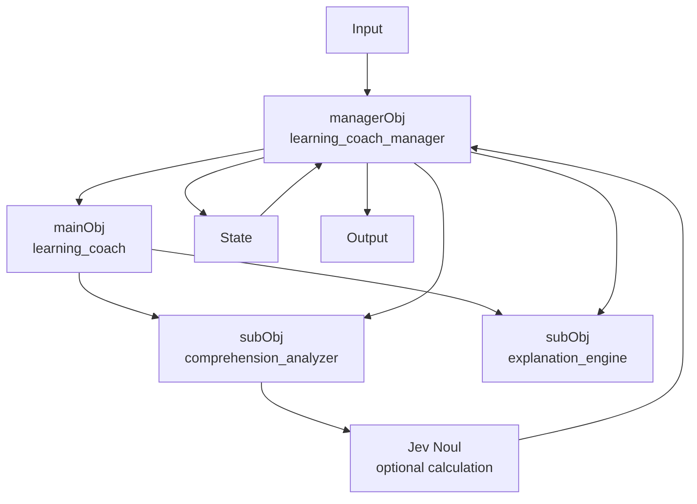

# Canonical minimal ALO

This example demonstrates the **core ALO semantics**, not merely an execution workflow.

## Four required concepts

- `mainObj`: the learning coach as the whole object
- `subObjList`: comprehension analyzer and explanation engine
- `State`: level, progress, memory, active status
- `managerObj`: reads input, coordinates objects, optionally calls Jev, updates State, and emits output

## Conceptual diagram

The Jev node is optional execution detail. Removing Jev does not remove the ALO.

## Reproducibility

A run should record the exact ALO version, input, State before, manager steps, sub-objects used, Jev request/result when used, deterministic calculations, State after, and output.
