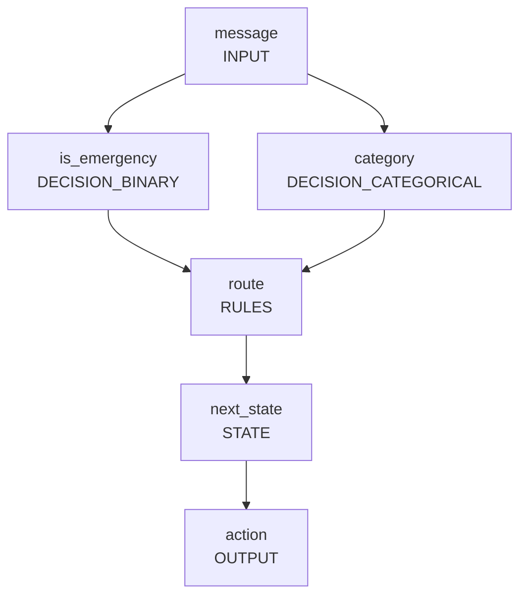

# Minimal example: support triage

This example demonstrates the smallest useful Open ALO workflow:

1. accept one text input;
2. ask two semantic questions;
3. keep uncertainty as probabilities;
4. apply deterministic thresholds and routing rules;
5. emit an action and next state.

## Source

See `alo.yaml`.

## Example input

```json
{
  "message": "Our production system is down and nobody can log in."
}
```

## Expected graph shape



The Mermaid block above is documentation only. Once the compiler exists, diagrams MUST be generated from canonical Graph IR rather than maintained by hand.

## Intended commands

```bash
alo validate alo.yaml
alo graph alo.yaml
alo run alo.yaml --input input.json
```
